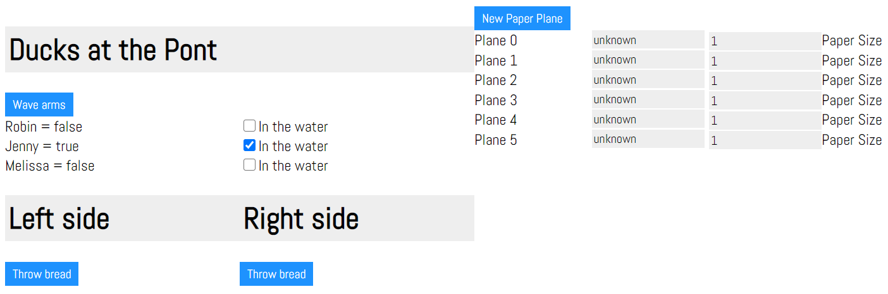

# iwgui

## Overview

This is a prototype for a debugging GUI created by a immediate-mode interface in Rust code and displayed in the browser.



```Rust
fn main() {
    let mut server = Server::new("127.0.0.1:8080");
    let mut model = Model::example();
    loop {
        for connection in &mut server.connections() {
            let mut gui = connection.gui();
            let root = gui.root();
            let (left, right) = root.vertical_panels();

            // Build the left side of the GUI
            ducks(left, &mut model.ducks_at_the_pont);

            // Build the right side of the GUI
            paper_planes(right, &mut model.paper_planes);

            connection.show_gui(gui);
        }
        thread::sleep(Duration::from_millis(50));
    }
}

fn ducks(left: Indeterminate, ducks_at_the_pont: &mut Vec<Duck>) {
    let mut stack = left.stacklayout();
    stack.header("Ducks at the Pont".to_owned());
    if stack.button().text("Wave arms").finish() {
        println!("Waving arms like a lunatic");
    }
    for duck in ducks_at_the_pont {
        let (l, r) = stack.layout().vertical_panels();
        l.stacklayout()
            .label(format!("{} = {}", &duck.name, duck.in_the_water))
            .handle(&PtrHandle::new(duck))
            .finish();
        let handle = PtrHandle::new(duck);
        r.stacklayout()
            .checkbox(&mut duck.in_the_water)
            .handle(&handle)
            .text("In the water")
            .finish();
    }
    let lower = stack.layout();
    let (lower_left, lower_right) = lower.vertical_panels();
    let mut lower_left_stack = lower_left.stacklayout();
    lower_left_stack.header("Left side");
    if lower_left_stack.button().text("Throw bread").finish() {
        println!("Throwing bread from the left side");
    }
    let mut lower_right_stack = lower_right.stacklayout();
    lower_right_stack.header("Right side");
    if lower_right_stack.button().text("Throw bread").finish() {
        println!("Throwing bread from the right side");
    }
}

// snip
```